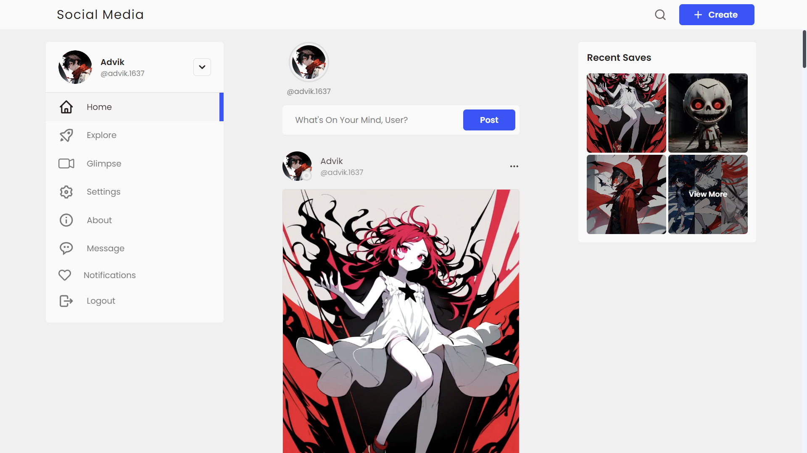
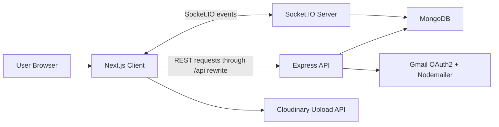
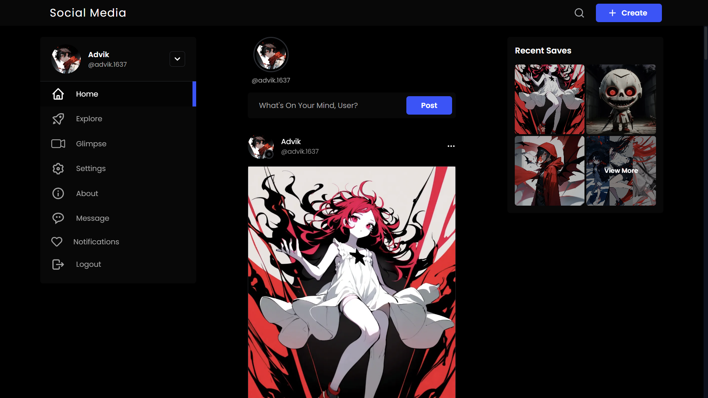

<p align="center">
  
</p>

<h1 align="center">🍒 Wonder Hive</h1>

<p align="center">
  A full-stack social media platform built with Next.js, Express.js, MongoDB, Socket.IO, and Cloudinary.
  Wonder Hive supports posts, glimpses, stories, highlights, realtime chat, notifications, profile discovery, and customizable user settings.
</p>

<p align="center">
  
  
  
  
  
  
</p>

<p align="center">
  <a href="#overview">Overview</a> |
  <a href="#features">Features</a> |
  <a href="#technology-stack">Technology</a> |
  <a href="#project-structure">Structure</a> |
  <a href="#getting-started">Getting Started</a> |
  <a href="#environment-variables">Environment Variables</a> |
  <a href="#screenshots">Screenshots</a> |
  <a href="#license">License</a>
</p>

## 🔴Overview

Wonder Hive is a modern social networking application. The project is organized as a two-part full-stack system:

- `site/` contains the Next.js web client.
- `api/` contains the Express.js REST API, MongoDB models, authentication middleware, mail utilities, and Socket.IO realtime server.

The application allows users to create accounts, activate accounts through email, publish media-rich posts, publish short-form glimpse content, share temporary stories, group old stories into highlights, follow other users, manage private accounts, chat in realtime, receive notifications, and personalize the interface theme.

## 🔴Features

### Authentication and Account Access

- User registration with username availability checks.
- Account activation by email.
- Login using email or username.
- JWT access tokens and refresh-token cookies.
- Password reset through email.
- Protected API routes through authentication middleware.

### User Profiles and Social Graph

- Public and private user profiles.
- Profile picture, full name, username, bio, website, gender, note, and activity settings.
- Follow, unfollow, follow request, accept request, and decline request flows.
- Followers and following lists.
- Suggested users and profile suggestions.
- Activity visibility with online/offline presence.

### Posts and Glimpses

- Create, update, delete, like, unlike, save, and unsave post/glimpse content.
- Media upload support through Cloudinary.
- Feed generation from followed users.
- Explore pages with random posts and masonry-style discovery.
- Infinite scrolling for feed, explore, profile posts, glimpses, and saved items.
- Shareable post and glimpse URLs.

### Stories and Highlights

- Create and delete stories.
- Feed stories from followed users.
- Story archive support.
- Story views and hearts.
- User story collections on profiles.
- Create, update, delete, and view highlights built from stories.

### Comments and Engagement

- Create, update, delete, like, and unlike comments.
- Comment tagging and reply references.
- Notifications for social interactions.

### Messaging and Realtime Communication

- One-to-one and group conversation data model.
- Create and delete conversations.
- Create, load, and delete messages.
- Realtime message delivery with Socket.IO.
- Seen/unseen message tracking.
- Typing indicators.
- Browser notification and sound support.

### Interface and User Experience

- Responsive Next.js interface.
- Tailwind CSS theme system using CSS variables.
- Light/dark theme support.
- Theme color, font, font size, and border-radius preferences.
- Notification, message, and glimpse sound settings.
- Multi-account state support.
- Custom error pages, loaders, preloader, reusable buttons, cards, tooltips, and switches.

### System Design

Wonder Hive follows a client-server architecture with a separate presentation layer, application/API layer, persistence layer, media storage service, and realtime communication channel.



From an system-design perspective, the project separates responsibilities into layered components:

- Presentation layer: Next.js pages and React components render the user interface, manage navigation, and dispatch client-side state updates.
- Application layer: Express controllers implement business rules such as authentication, following, content creation, messaging, notifications, and profile access control.
- Data layer: Mongoose schemas define the persistent domain entities and relationships for users, posts, stories, highlights, comments, conversations, messages, and notifications.
- Realtime layer: Socket.IO provides event-driven updates for messages, notifications, feed changes, story updates, typing states, and activity presence.
- External service layer: Cloudinary handles media object storage, while Gmail OAuth2/Nodemailer handles activation and password reset emails.

This design improves modularity because the frontend can evolve independently from the backend API. It also improves scalability at the conceptual level: REST endpoints handle durable state changes, while sockets handle transient, low-latency events such as typing, online presence, and live notifications. MongoDB is suitable here because social-media content often has flexible documents, embedded arrays, and evolving metadata such as likes, saves, views, recipients, and read states.


## 🔴Technology Stack

| Layer | Technologies |
| --- | --- |
| Frontend | Next.js 13, React 18, Tailwind CSS, Framer Motion |
| State Management | React Context + reducer/action pattern |
| Backend | Node.js, Express.js |
| Database | MongoDB with Mongoose |
| Realtime | Socket.IO |
| Authentication | JWT, bcrypt, HTTP-only refresh-token cookies |
| Media Storage | Cloudinary |
| Email | Nodemailer with Google OAuth2 |
| Security and Middleware | Helmet, CORS, cookie-parser, Morgan |
| Deployment Support | Vercel config for API, Next.js rewrites for API proxying |

## 🌹Project Structure

```bash
wonder-hive/
├── README.md
├── LICENSE
├── banner.jpg
├── api/
│   ├── index.js
│   ├── package.json
│   ├── vercel.json
│   ├── controllers/
│   ├── middlewares/
│   ├── models/
│   ├── routes/
│   ├── socket/
│   └── utils/
└── site/
    ├── package.json
    ├── next.config.js
    ├── tailwind.config.js
    ├── components/
    ├── hooks/
    ├── pages/
    ├── public/
    ├── screenshots/
    ├── socket/
    ├── store/
    ├── styles/
    └── utils/
```

## 🔴Getting Started

### Prerequisites

- Node.js 16 or newer
- npm
- MongoDB database, local or hosted
- Cloudinary account for media upload
- Gmail OAuth2 credentials for activation and reset emails

### 1. Install Backend Dependencies

```bash
cd api
npm install
```

### 2. Install Frontend Dependencies

```bash
cd ../site
npm install
```

### 3. Configure Environment Variables

Create one `.env` file inside `api/` and one `.env.local` file inside `site/`. Use the variables listed in the next section.

### 4. Run the Backend

```bash
cd api
npm run dev
```

The API runs on `http://localhost:5000` by default unless `PORT` is provided.

### 5. Run the Frontend

```bash
cd site
npm run dev
```

The frontend runs on `http://localhost:3000`.

## 🌹Environment Variables

### Backend: `api/.env`

```env
PORT=5000
MONGODB_URL=mongodb://127.0.0.1:27017/wonder_hive

CLIENT_URL=http://localhost:3000

ACTIVATION_TOKEN_SECRET=your_activation_secret
ACCESS_TOKEN_SECRET=your_access_secret
REFRESH_TOKEN_SECRET=your_refresh_secret

MAILING_SERVICE_CLIENT_ID=your_google_oauth_client_id
MAILING_SERVICE_CLIENT_SECRET=your_google_oauth_client_secret
MAILING_SERVICE_REFRESH_TOKEN=your_google_oauth_refresh_token
SENDER_EMAIL_ADDRESS=your_email@example.com
```

### Frontend: `site/.env.local`

```env
NEXT_PUBLIC_API_URL=http://localhost:5000
NEXT_PUBLIC_BASE_URL=http://localhost:3000

NEXT_PUBLIC_CLOUDINARY_CLOUD_NAME=your_cloudinary_cloud_name
NEXT_PUBLIC_CLOUDINARY_UPLOAD_PRESET=your_unsigned_upload_preset
```

## 🔴Available Scripts

### Backend

| Command | Description |
| --- | --- |
| `npm start` | Start the Express server with Node.js. |
| `npm run dev` | Start the Express server with Nodemon. |

### Frontend

| Command | Description |
| --- | --- |
| `npm run dev` | Start the Next.js development server. |
| `npm run build` | Build the production frontend. |
| `npm start` | Start the production frontend after building. |
| `npm run lint` | Run Next.js linting. |

## 🔴API Summary

All backend routes are mounted under `/api`.

| Module | Main Routes |
| --- | --- |
| Auth | `POST /auth/sign_up`, `POST /auth/activate_user`, `POST /auth/sign_in`, `GET /auth/refresh_token/:id`, `GET /auth/sign_out/:id`, `POST /auth/forgot_password`, `POST /auth/reset_password` |
| Users | `GET /user/search`, `PATCH /user/update`, `GET /user/username/:username`, `GET /user_suggestions`, `PATCH /user/:id/follow`, `PATCH /user/:id/follow/accept`, `PATCH /user/:id/follow/decline`, `PATCH /user/:id/unfollow` |
| Posts and Glimpses | `POST /post-glimpse/create`, `PATCH /post-glimpse/update/:id`, `DELETE /post-glimpse/delete/:id`, `GET /post-glimpse/feed`, `GET /post-glimpse/saves`, `PATCH /post-glimpse/like/:id`, `PATCH /post-glimpse/save/:id`, `GET /post-glimpse/posts/random`, `GET /post-glimpse/glimpses/random` |
| Stories | `GET /stories`, `POST /story/create`, `DELETE /story/delete/:id`, `GET /story/archive`, `GET /story/user/:id`, `PATCH /story/:id/view`, `PATCH /story/:id/heart` |
| Highlights | `POST /highlight/create`, `PATCH /highlight/update/:id`, `DELETE /highlight/delete/:id`, `GET /highlight/user/:id` |
| Comments | `POST /comment/create`, `PATCH /comment/update/:id`, `PATCH /comment/:id/like`, `DELETE /comment/delete/:id` |
| Conversations | `POST /conversation/create`, `GET /conversations/get`, `DELETE /conversation/:id` |
| Messages | `POST /message/create`, `GET /message/conversation/:id`, `DELETE /message/delete/:ref/:id` |
| Notifications | `GET /notify/all`, `POST /notify/create`, `PATCH /notify/read-all`, `DELETE /notify/id/:id`, `DELETE /notify/all` |

## 🔴Screenshots

The project includes screenshots in `site/screenshots/`.

<table>
  <tr>
    <td align="center">
      <strong>Light Theme</strong><br><br>
      
    </td>
    <td align="center">
      <strong>Dark Theme</strong><br><br>
      
    </td>
  </tr>
</table>

## 🔴Deployment
- The backend includes `api/vercel.json` for Vercel serverless deployment.
- The frontend uses `next.config.js` rewrites so browser requests to `/api/:path*` are forwarded to `NEXT_PUBLIC_API_URL`.
- For production, configure environment variables in the hosting provider for both frontend and backend deployments.
- Cloudinary upload presets should be restricted appropriately before production use.
- JWT secrets must be long, random, and private.

## 🔴License

This project is licensed under the MIT License. See [LICENSE](LICENSE) for details.

## 🔴Author

**Ashish Kumar**
